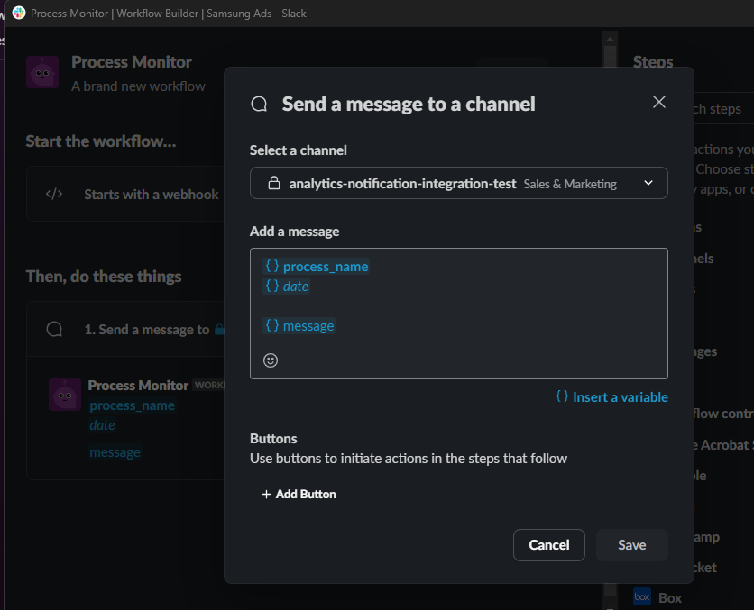
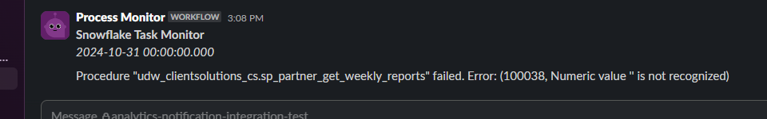

# Snowflake Notifications

## Problem
With the decision to move toward the automation of client reporting and audience creation, we needed some mechanism to notify us when in the even that an automated process fails. 

This method of sending messages to a Slack webhook through Snowflake was selected because it allows our team to post failure notifications to our shared Slack channel. This not only notifies the owner of the failed process, it also allows the team to see when a process fails so that there is visibility even when the owner is not in the office.

## Prerequisites - Snowflake
This process will require a support ticket if you do not have appropriate permissions. You will need to need to have a network rule and external access integration created, or request access to this one.

Network Rule:
```
CREATE OR REPLACE NETWORK RULE _udw_system.client_solutions_slack_webhook_network_rule
  MODE = EGRESS
  TYPE = HOST_PORT
  VALUE_LIST = ('hooks.slack.com');
```

External Access Integration:
```
CREATE OR REPLACE EXTERNAL ACCESS INTEGRATION client_solutions_slack_access_integration
ALLOWED_NETWORK_RULES = (_udw_system.client_solutions_slack_webhook_network_rule)
ENABLED = true;
```

Permnissions:
```
GRANT USAGE ON SCHEMA _udw_system TO ROLE UDW_CLIENTSOLUTIONS_DEFAULT_CONSUMER_ROLE_PROD;
GRANT USAGE ON NETWORK RULE _udw_system.client_solutions_slack_webhook_network_rule TO ROLE UDW_CLIENTSOLUTIONS_DEFAULT_CONSUMER_ROLE_PROD;
GRANT USAGE ON INTEGRATION client_solutions_slack_access_integration TO ROLE UDW_CLIENTSOLUTIONS_DEFAULT_CONSUMER_ROLE_PROD;
```

- Ticket: https://adgear.atlassian.net/servicedesk/customer/portal/11/PS-6789?created=true
- Instructions: https://adgear.atlassian.net/wiki/spaces/SSIM/pages/19218137121/How+to+Raise+Support+Ticket


## Prerequisites - Slack
For this process, you will need to create a Slack webhook. This is a url that you a post a JSON object to. The key/values in the object will be extracted as variables and can be posted to a Slack channel as a message.

1. Right-click on the Slack channel and select "View channel details"
1. Click on the "Integrations" tab
1. Click "Add Automation"
1. In the new window that opens, click on "New Workflow" and select "Build Workflow"
1. Name your workflow and give it a description
1. For "Start the workflow..." click on "From a Webhook"
1. Click "Set Up Variables". You can specify what variables you expect and their data type.
1. Under "Then, do these things" click "Add steps". Select Messages/Send a message to a channel.
1. Select the channel from the list
1. Add a message. You can insert the variables in the text with curly brackets (e.g., Hello, {name})
1. Save and Publish the workflow.


Alternate Instructions:
- Web: https://api.slack.com/messaging/webhooks
- Local Copy: [webhooks.pdf](assets/webhooks.pdf)




## Optional - UDF
Create a Snowflake user Defined Function to post JSON to the Slack webhook. This allows users to have a simple/quick interface to send messages to Slack.

We created two functions. 
- udf_submit_slack_notification_simple - Allows user to pass in the message as a string for use with our basic webhook workflow
- udf_submit_slack_notification_custom - Allows user to pass in header and data JSON if there is a need for customization for a different workflow


## Simple Function

```
CREATE OR REPLACE FUNCTION udw_clientsolutions_cs.udf_submit_slack_notification_simple(
    slack_webhook_url STRING
    ,date_string STRING
    ,name_string STRING
    ,message_string STRING
)
RETURNS STRING
LANGUAGE PYTHON
RUNTIME_VERSION = 3.9
HANDLER = 'post_message'
EXTERNAL_ACCESS_INTEGRATIONS = (client_solutions_slack_access_integration)
PACKAGES = ('snowflake-snowpark-python','requests')
AS
$$
import _snowflake
import requests
import json
session = requests.Session()

def post_message(slack_webhook_url, date_string, name_string, message_string):

    url     = slack_webhook_url
    headers = {"Content-type": "application/json"}
    data    = {
        "date": date_string,
        "message": message_string,
        "process_name": name_string
    }

    response = session.post(url, data = json.dumps(data), headers = headers)

    return str(response.status_code)

$$;
```

### Simple Function Usage
```
SELECT udw_clientsolutions_cs.udf_submit_slack_notification_simple(
    slack_webhook_url => 'https://hooks.slack.com/triggers/E01HK7C170W/7564869743648/xxxxxxxxxxxxxxxxxxxxxxxxxxxxxxxx'
    ,date_string => '2024-10-28'
    ,name_string => 'Snowflake Task Monitor'
    ,message_string => 'This is just a test!!'
);
```


## Custom Function
```
CREATE OR REPLACE FUNCTION udw_clientsolutions_cs.udf_submit_slack_notification_custom(
    slack_webhook_url STRING
    ,header_json_string STRING
    ,data_json_string STRING
)
RETURNS STRING
LANGUAGE PYTHON
RUNTIME_VERSION = 3.9
HANDLER = 'post_message'
EXTERNAL_ACCESS_INTEGRATIONS = (client_solutions_slack_access_integration)
PACKAGES = ('snowflake-snowpark-python','requests')
AS
$$

import _snowflake
import requests
import json
session = requests.Session()

def post_message(slack_webhook_url, header_json_string, data_json_string):

    url     = slack_webhook_url
    headers = json.loads(header_json_string)
    data    = json.loads(data_json_string)

    response = session.post(url, data = json.dumps(data), headers = headers)

    return str(response.status_code)

$$;
```

### Custom Function Usage
```
SELECT udw_clientsolutions_cs.udf_submit_slack_notification_custom(
    slack_webhook_url => 'https://hooks.slack.com/triggers/E01HK7C170W/7564869743648/xxxxxxxxxxxxxxxxxxxxxxxxxxxxxxxx'
    ,header_json_string => '{"Content-type": "application/json"}'
    ,data_json_string => '{
        "date": "2024-10-28",
        "process_name": "Snowflake Task Monitor",
        "message": "This is just a test!!"
    }'
);
```

## Advance Usage
```
CREATE OR REPLACE PROCEDURE udw_clientsolutions_cs.sp_foobar(
    -- specify parameters for procedure
    start_date                 VARCHAR     --> start of reporting window
    ,end_date                  VARCHAR     --> end of reporting window
)
RETURNS STRING
LANGUAGE SQL
AS
$$
DECLARE 
    -- specify variables used in this stored procedure
    current_date              TIMESTAMP;  --> today
BEGIN


    -- get current date
    current_date := CURRENT_DATE();

    ...DO STUFF...

    RETURN 'SUCCESS';


-- handle exception
EXCEPTION
    WHEN OTHER THEN
        SELECT udw_clientsolutions_cs.udf_submit_slack_notification_simple(
            slack_webhook_url => 'https://hooks.slack.com/triggers/E01HK7C170W/7564869743648/xxxxxxxxxxxxxxxxxxxxxxxxxxxxxxxx'
            ,date_string => :current_date::VARCHAR
            ,name_string => 'Snowflake Task Monitor'
            ,message_string => 'Procedure foobar failed.' || ' (Error Code: ' || :SQLCODE || ', Error message: ' || :SQLERRM || ')'
        );

        RETURN 'FAILED WITH ERROR(' || :SQLCODE || ', ' || :SQLERRM || ')';

END;
$$;
```

## Slack


## Capture response status code
```
-- returns 200 on success
SET code = (SELECT udw_clientsolutions_cs.udf_submit_slack_notification_custom(
                slack_webhook_url => 'https://hooks.slack.com/triggers/E01HK7C170W/7564869743648/xxxxxxxxxxxxxxxxxxxxxxxxxxxxxxxx'
                ,header_json_string => '{"Content-type": "application/json"}'
                ,data_json_string => '{
                    "date": "2024-10-28",
                    "process_name": "Snowflake Task Monitor",
                    "message": "This is just a test!!"
                }'
            ));
```

# Logs and debugging
Code blocks and stored procedures only output what you return. I have found it helpful to create a log array, append messages through out key points in the query, and append the log to the error message if the script fails. This not only tells me what went wrong but gives a better idea of where in the script the failure occoured.

```
DECLARE
    log             ARRAY;      --> array to store log messages for debugging
    log_message     VARCHAR;    --> message to add to the log array. For debugging.
```
```
BEGIN
    -- init logging
    log := ARRAY_CONSTRUCT();
    log_message := '';
```
```
    -- log message (e.g., Region EU processing completed.)
    log_message := 'Region ' || :region || ' processing completed.';
    log := (SELECT ARRAY_APPEND(:log, :log_message));
```
```
-- handle exception
EXCEPTION
    WHEN OTHER THEN
        -- Task xyz failed. Error: (0, error message) || LOG: (message 1 => message 2 => message 3)
        SELECT udw_clientsolutions_cs.udf_submit_slack_notification_simple(
            slack_webhook_url => 'https://hooks.slack.com/triggers/E01HK7C170W/7564869743648/xxxxxxxxx'
            ,date_string => :current_date::VARCHAR
            ,name_string => 'Snowflake Task Monitor'
            ,message_string => 'Task "' || :task_name || '" failed.' || 
                ' Error: (' || :SQLCODE || ', ' || :SQLERRM || ')' ||
                ' || LOG: (' || ARRAY_TO_STRING(:log, ' => ') || ')'
        );

        RETURN 'FAILED WITH ERROR(' || :SQLCODE || ', ' || :SQLERRM || ')';

END;
$$;
```